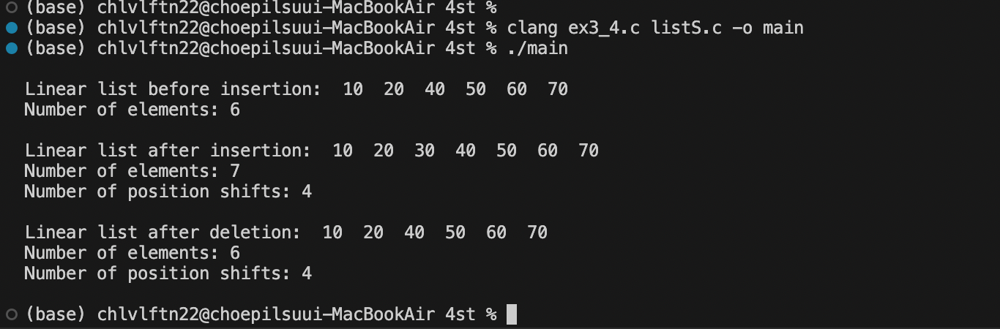

### MAC에서 컴파일 및 실행시 code Runner로 실행하면 에러 발생

- 해결 방법 : clang 혹은 gcc 컴파일러로 수동으로 빌드 후 빌드 파일 실행

- 참조 링크 : [https://stackoverflow.com/questions/66502205/mac-os-vs-code-insiders-code-runner-undefined-symbols-for-architecture-arm6]
